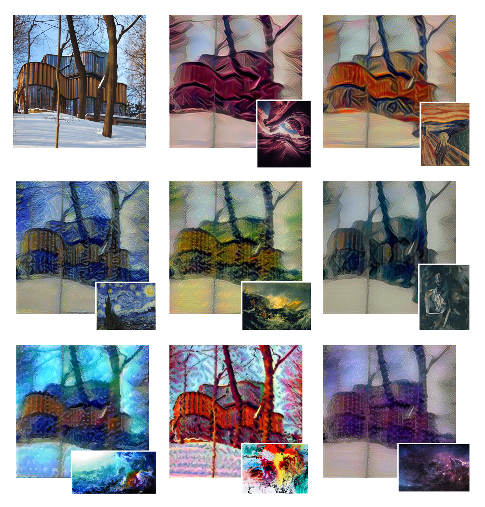

# Artistic Learning

Neural style transfer built on TensorFlow and Keras in Python with a deep convolutional neural network (CNN). Creates artistic image by recombining input content and style, using NumPy to shape neural representations.

## Features

Performs neural style transfer as described in the original paper, [A Neural Algorithm of Artistic Style](https://arxiv.org/pdf/1508.06576.pdf) by Gatys, Ecker, and Bethge. The following is taken from the paper.

We introduce an artificial system based on a deep neural network that creates artistic images of high perceptual quality. The system uses neural representations to separate and recombine content and style of arbitrary images, providing a neural algorithm for the creation of artistic images.

Each layer of a convolutional neural network can be understood as a collection of image filters, each of which extracts a certain feature from the input image. When convolutional neural networks are trained on object recognition, they develop a representation of the image that makes object information increasingly explicit along the processing hierarchy.

The representations of content and style in the convolutional neural network are separable. That is, we can manipulate both representations independently to produce new, perceptually meaningful images. To demonstrate this finding, we generate images that mix the content and style representation from two different source images.

## Examples




## Getting Started

These instructions will get you a copy of the project up and running on your local machine.

### Prerequisites

Python must be installed, along with the following libraries.

* TensorFlow
* Matplotlib
* NumPy
* Pillow

These can be installed using ```pip install library-name```.

### Running

How to run the application

1. Clone the repository.
2. Open [transfer.py](src/transfer.py). Adjust the hyperparameters at the top of the file as needed. 
3. Run [transfer.py](src/transfer.py) with ```python transfer.py```. The output image is saved in [data/output](data/output).

## Built With

* [TensorFlow](https://www.tensorflow.org/) - Deep Learning

## License

This project is licensed under the MIT License - see [LICENSE](LICENSE) file for details.
